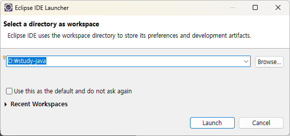
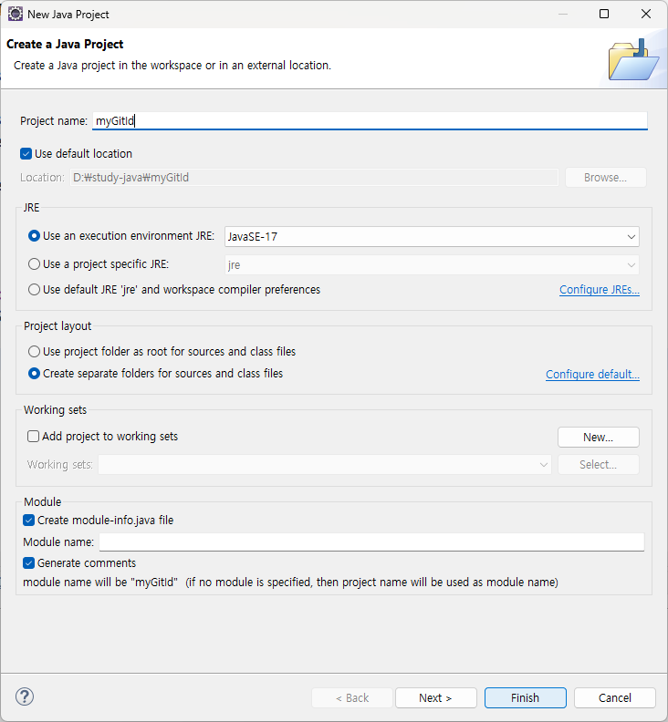

# 스터디 레포지토리 참여 방법
1. [깃 클론](#깃-클론)
2. [폴더 내부에 자바 프로젝트 생성](#폴더-내부에-자바-프로젝트-생성)
3. [프로젝트 안에 패키지 및 클래스 생성](#프로젝트-안에-패키지-및-클래스-생성)

## 깃 클론
- 깃 레포지토리 주소 : https://github.com/ynnotun/study_java.git
- 원하는 위치에서 `git bash` 열기
- 아래의 명령어 입력
```
git clone https://github.com/ynnotun/study_java.git
```
- 깃 클론 완료되면 해당 파일로 들어가 잘 다운 받아졌는지 확인

## 폴더 내부에 자바 프로젝트 생성
- 깃 클론한 폴더를 경로로 설정하여 이클립스 런치


- 자바 프로젝트 생성


- 자신의 github 아이디를 이름으로 한 프로젝트 생성


## 프로젝트 안에 패키지 및 클래스 생성
- 자신의 프로젝트 내부에 패키지 및 클래스 생성
- 패키지 이름과 클래스 이름은 알아보기 쉽게 작성한다

### 예시
- 패키지 이름 : study0401
- 클래스 이름 : Book_173
